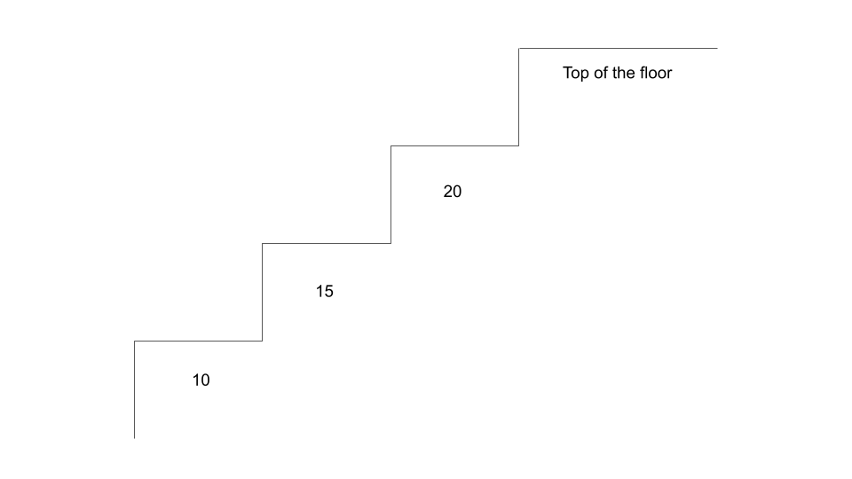

<!-- markdownlint-disable -->

# Solution: Dynamic Programming

<h2>Understanding the Problem</h2>

The "top of the floor" does not refer to the final index of `costs`. We actually need to "arrive" beyond the array's bounds.

We need to either take 1 step or 2 steps at a time, and our goal is to minimize the overall cost.
 

<h2>Bottom-Up Dynamic Programming aka Tabulation</h2>

Bottom-Up Dynamic Programming is also known as **tabulation** and is done iteratively. DP is based on the concept of **overlapping subproblems** and **optimal substructures**. This is when the solution to a problem can be constructed from solutions to similar and smaller subproblems. Solving a smaller version of the problem can be easier and faster, thus if we break up the problem into smaller subproblems, solving them can lead us to the final solution easier and faster.
