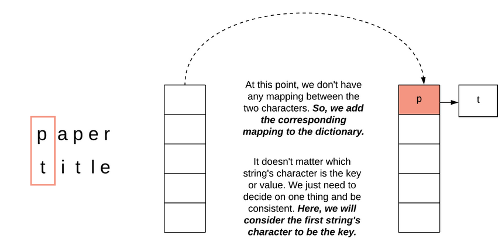
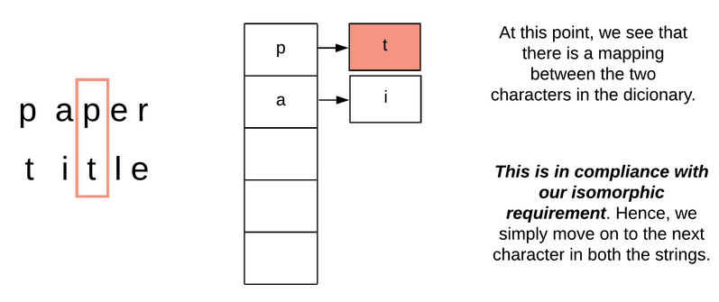
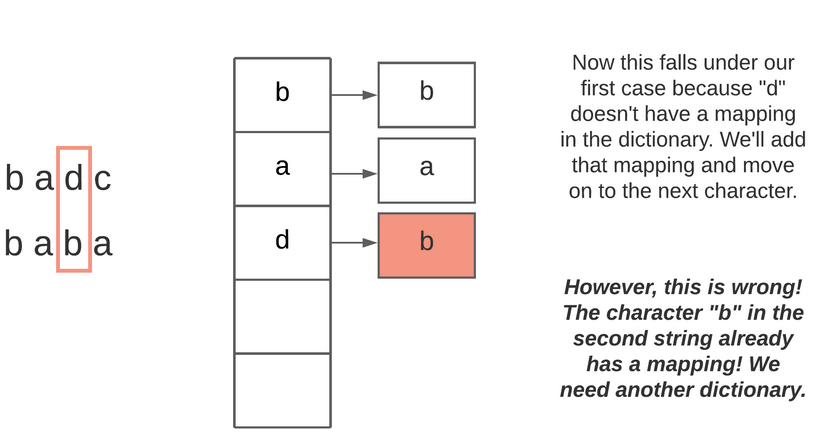

<!-- markdownlint-disable -->

# Solution

<h2>Conditions</h2>

These 3 conditions must be met for the two strings to be isomorphic:

<ol>
    <li>We can map a character only to itself or to one other character.</li>
    <li>No two character should map to same character.</li>
    <li>Replacing each character in string <code>s</code> with the character it is mapped to results in string <code>t</code></li>
</ol>

Matching the order is easy. We will iterate over two strings and do a comparison from left to right, the task of ensuring that the character order is the same in both strings will take care of itself. Next, we need to maintain a mapping of characters (dictionary).

<h2>Character Mapping with a MAP</h2>

**INTUITION**

Process both of the strings from left to right. At each step, we take one character at a time from the two strings and compare them. There are three cases we need to handle:

<ol>
    <li>If the characters don't have a mapping, we add one in the dictionary and move on 
     
     
    The first encounter for a new character in both strings which are not yet mapped.</li> 
    <li>The characters already have a mapping in the dictionary. If that is the case, then we're good to go 
     
     </li> 
    <li>When a mapping already exists for one of the characters but it doesn't map to the other character at hand. In this case, we can safely conclude that the given strings are not isomorphic and we can return. 
     
    </li>
</ol>
 

Two dictionaries/maps will be needed instead of one since we need one-to-one mapping from the string `s` to string `t` and vice versa.

<h2>Algorithm</h2>

<ol>
    <li>We define a dictionary/map <code>mapping_s_t</code> which will be used to map characters in string <code>s</code> to characters in string <code>t</code> and another dictionary <code>mapping_t_s</code> which will be used to map characters in string <code>t</code> to characters in string <code>s</code>.</li>
    <li>Next, we iterate over the two strings one character at a time.</li>
    <li>Let's assume the character in the first string is <code>c1</code> and the corresponding character in the second string is <code>c2</code>.
    <ol style="">
        <li>if <code>c1</code> does not have a mapping in <code>mapping_s_t</code> and <code>c2</code> does not have a mapping in <code>mapping_t_s</code>, we add the corresponding mappings in both the dictionaries and move on to the next character.</li>
        <li>At this point, we expect both the character mappings to exist in the dictionaries and their values should be <code>mapping_s_t[c1] = c2</code> and <code>mapping_t_s[c2] = c1</code>. If either of these conditions fails (<code>c1</code> is not in the dictionary, <code>c2</code> is not in the dictionary, unexpected mapping), we return <code>false</code>.</li>
    </ol></li>
    <li>Return <code>true</code> once both the strings have been exhausted.</li>
</ol>
