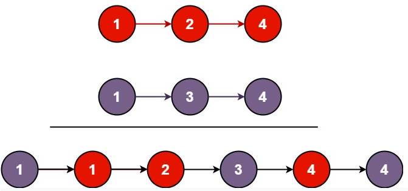

<!-- markdownlint-disable -->

# Merge Two Sorted Lists

You are given the heads of two sorted linked lists `list1` and `list2`.

Merge the two lists in a one **sorted** list. The list should be made by splicing together the nodes of the first two lists.

Return the head of the merged linked list. 

**Example 1:**

<pre><code><strong>Input:</strong>      list1 = [1,2,4], list2 = [1,3,4]
<strong>Output:</strong>     [1,1,2,3,4,4]</code></pre>
 

**Example 2:**

<pre><code><strong>Input:</strong>      list1 = [], list2 = []
<strong>Output:</strong>     []</code></pre>
 

**Example 3:**

<pre><code><strong>Input:</strong>      list1 = [], list2 = [0]
<strong>Output:</strong>     [0]</code></pre>
 
 

**Constraints:**

<ul>
    <li>The number of nodes in both lists is in the range <code>[0, 50]</code>.</li>
    <li><code>-100 <= Node.val <= 100</code></li>
    <li>Both <code>lists1</code> and <code>lists2</code> are sorted in <strong>non-decreasing</strong> order.</li>
<ul>
