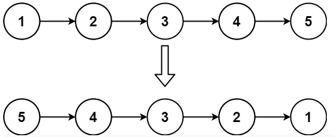
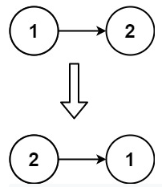

<!-- markdownlint-disable -->

# Reverse Linked List

Given the `head` of a singly linked list, reverse the list, return the reversed list 

**Example 1:**

<pre><code><strong>Input:</strong>     head = [1,2,3,4,5]
<strong>Output:</strong>    [5,4,3,2,1]</code></pre>
 

**Example 2:**

<pre><code><strong>Input:</strong>     head = [1,2]
<strong>Output:</strong>    [2,1]</code></pre>
 

**Example 3:**

<pre><code><strong>Input:</strong>     head = []
<strong>Output:</strong>    []</code></pre>
 
 

**Constraints:**

<ul>
    <li>The number of nodes in the list is the range <code>[0, 5000]</code></li>
    <li><code>-5000 <= Node.val <= 5000</code></li>
</ul>
