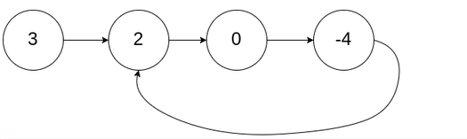
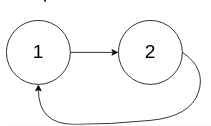
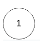

<!-- markdownlint-disable -->

# Linked List Cycle II

Given the `head` of a linked list, return the node where the cycle begins. if there is no cycle, return `nil`

There is a cycle in a linked list if there is some node in the list that can be reached again by continuously following the `next` pointer. Internally, `pos` is used to denote the index of the node that tail's `next` pointer is connected to (**0-index**). It is `-1` if there is no cycle. **Note that** `pos` **is not passed as a parameter**.

**Do not modify** the linked list. 

**Example 1:**

<pre><code><strong>Input:</strong>          head = [3,2,0,-4], pos = 1
<strong>Output:</strong>         tail connects to node index 1
<strong>Explanation:</strong>    There is a cycle in the linked list, where tail connects to the second node.</code></pre>
 

**Example 2:**

<pre><code><strong>Input:</strong>          head = [1,2], pos = 0
<strong>Output:</strong>         tail connects to node index 0
<strong>Explanation:</strong>    There is a cycle in the linked list, where tail connects to the first node.</code></pre>
 

**Example 3:**

<pre><code><strong>Input:</strong>          head = [1], pos = -1
<strong>Output:</strong>         no cycle
<strong>Explanation:</strong>    There is no cycle in the linked list.</code></pre>
 
 

**Constraints:**

<ul>
    <li>The number of nodes in the list is in the range <code>[0, 104]</code>.</li>
    <li><code>-105 <= Node.val <= 105</code></li>
    <li><code>pos</code> is <code>-1</code> or a <strong>valid index</strong> in the linked list.</li>
</ul>
