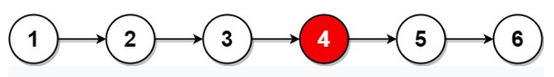

<!-- markdownlint-disable -->

# Middle of the Linked List

Given the `head` of singly linked list, return the middle node of the linked list.

If there are two middle nodes, return **the second middle** node. 

**Example 1:**

<pre><code><strong>Input:</strong>         head = [1,2,3,4,5]
<strong>Output:</strong>        [3,4,5]
<strong>Explanation:</strong>   The middle node of the list is node 3.</code></pre>
 

**Example 2:**

<pre><code><strong>Input:</strong>         head = [1,2,3,4,5,6]
<strong>Output:</strong>        [4,5,6]
<strong>Explanation:</strong>   Since the list has two middle nodes with values 3 and 4, we return the second one.</code></pre>
 
 

**Constraints:**

<ul>
    <li>The number of nodes in the list is in the range <code>[1, 100]</code>.</li>
    <li><code>1 <= Node.val <= 100</code></li>
</ul>
