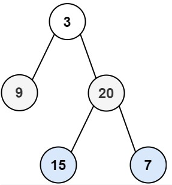

<!-- markdownlint-disable -->

# Binary Tree Level Order Traversal

Given the `root` of a binary tree, return the level order traversal of its nodes' values. (i.e., from left to right, level by level). 
 

**Example 1:**

<pre><code><strong>Input:</strong>     root = [3,9,20,null,null,15,7]
<strong>Output:</strong>    [[3],[9,20],[15,7]]

**Example 2:**

<pre><code><strong>Input:</strong>     root = [1]
<strong>Output:</strong>    [[1]]</code></pre>
 

**Example 3:**

<pre><code><strong>Input:</strong>     root = []
<strong>Output:</strong>    []</code></pre>
 
 

**Constraints:**

<ul>
    <li>The number of nodes in the tree is in the range <code>[0, 2000]</code></li>
    <li><code>-1000 <= Node.val <= 1000</code></li>
<ul>
