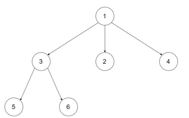
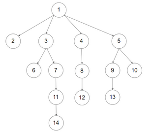

<!-- markdownlint-disable -->

# N-ary Tree Preorder Traversal

Given the `root` of an n-ary tree, return the <em>preorder</em> traversal of its nodes' values.

Nary-Tree input serialization is represented in their level order traversal. Each group of children is separated by the bull value (See examples)

**Example 1:**

<pre><code><strong>Input:          root = [1,null,3,2,4,null,5,6]</strong>
<strong>Output:</strong>         [1,3,5,6,2,4]</code></pre>

**Example 2:**

<pre><code><strong>Input:          root = [1,null,2,3,4,5,null,null,6,7,null,8,null,9,10,null,null,11,null,12,null,13,null,null,14]</strong>
<strong>Output:</strong>         [1,2,3,6,7,11,14,4,8,12,5,9,13,10]</code></pre>

**Constraints:**

<pre><code><ul><li>The Number of nodes in the tree is in the rance of <code>[0, 104]</code></li><li><code>0 <= Node.val <= 104</code></li><li>The height of the n-ary tree is less than or equal to <code>1000</code></li></ul></code></pre>
