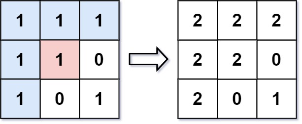

<!-- markdownlint-disable -->

# Flood Fill

An image is represented by an `m x n` integer grid `image` where `image[i][j]` represents the pixel value of the image.

You are also given three integers `sr`, `sc`, and `color`. you should perform **flood fill** on the image starting from the pixel `image[sr][sc]`.

To Perform a **flood fill**, consider the starting pixel, plus any pixels connected **4-directionally** to the starting pixel of the same color as the starting pixel, plus any pixels connected **4-directionally** to those pixels (also with the same color), and so on. Replace the color of all of the aforementioned pixels with `color`.

Return the modified image after performing the flood fill. 
 

**Example 1:**

<pre><code><strong>Input:</strong>          image = [[1,1,1],[1,1,0],[1,0,1]], sr = 1, sc = 1, color = 2
<strong>Output:</strong>         [[2,2,2],[2,2,0],[2,0,1]]
<strong>Explanation:</strong>    From the center of the image with position (sr, sc) = (1, 1) (i.e., the red pixel), 
all pixels connected by a path of the same color as the starting pixel (i.e., the blue pixels) are colored 
with the new color.
Note the bottom corner is not colored 2, because it is not 4-directionally connected to the starting pixel.</code></pre>
 

**Example 2:**

<pre><code><strong>Input:</strong>          image = [[0,0,0],[0,0,0]], sr = 0, sc = 0, color = 0
<strong>Output:</strong>         [[0,0,0],[0,0,0]]
<strong>Explanation:</strong>    The starting pixel is already colored 0, so no changes are made to the image.</code></pre>
 
 

**Constraints:**

<ul>
    <li><code>m == image.length</code></li>
    <li><code>n == image[i].length</code></li>
    <li><code>1 <= m, n <= 50</code></li>
    <li><code>0 <= image[i][j], color < 216</code></li>
    <li><code>0 <= sr < m</code></li>
    <li><code>0 <= sc < n</code></li>
</ul>
