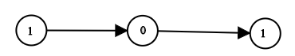

<!-- markdownlint-disable -->

# Convert Binary Number in a Linked List to Integer

Given `head` which is a reference node to a singly-linked list. The value of each node in the linked list is either `0` or `1`. the linked list holds the binary representation of a number.

Return the decimal value of the number in the linked list 
 

**Example 1:**

<pre><code><strong>Input:</strong>             head = [1,0,1]
<strong>Output:</strong>            5
<strong>Explanation:</strong>       (101) in base 2 = (5) in base 10</code></pre>

**Example 2:**

<pre><code><strong>Input:</strong>             head = [0]
<strong>Output:</strong>            0</code></pre>
 

**Constraints:**

<ul>
    <li>The Linked List is not empty.</li>
    <li>Number of nodes will not exceed <code>30</code>.</li>
    <li>Each node's value is either <code>0</code> or <code>1</code>.</li>
</ul>
