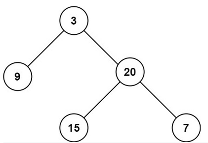

<!-- markdownlint-disable -->

# Maximum Depth of Binary Tree

Given the `root` of a binary tree, return its maximum depth

A binary tree's **maximum depth** is the number of nodes along the longest path from the root node down to the farthest leaf node. 
 

**Example 1:**

<pre><code><strong>Input:</strong>  root = [3,9,20,null,null,15,7]
<strong>Output:</strong> 3</code></pre>

**Example 2:**

<pre><code><strong>Input:</strong>  root = [1,null,2]
<strong>Output:</strong> 2</code></pre>
 

**Constraints:**

<ul>
    <li>The number of nodes in the tree is in the range <code>[0, 104]</code>.</li>
    <li><code>-100 <= Node.val <= 100</code></li>
</ul>
