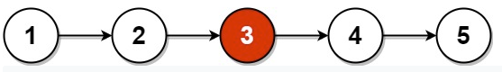
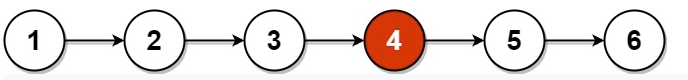

<!-- markdownlint-disable -->

# Middle of the Linked List

Given the `head` of a singly linked list, return the middle node of the linked list.

If there are two middle nodes, return the **second middle** node. 
 

**Example 1:**

<pre><code><strong>Input:</strong>                 head = [1,2,3,4,5]
<strong>Output:</strong>                [3,4,5]
<strong>Exaplanation:</strong>          The middle node of the list is node 3</code></pre>

**Example 2:**

<pre><code><strong>Input:</strong>                 head = [1,2,3,4,5,6]
<strong>Output:</strong>                [4,5,6]
<strong>Exaplanation:</strong>          Since the list has two middle nodes with values 3 and 4, we return the second one</code></pre>
 

**Constraints:**

<ul>
    <li>The number of nodes in the list is in the range <code>[1, 100]</code>.</li>
    <li><code>1 <= Node.val <= 100</code></li>
</ul>

 
<h2>Solution: Fast and Slow Pointer</h2>

When traversing the list with a pointer <code>slow</code>, make another pointer <code>fast</code> that traverses twice as fast. When <code>fast</code> reaches the end of the list, <code>slow</code> MUST be in the middle.
