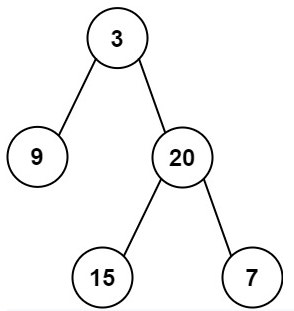

<!-- markdownlint-disable -->

# Sum of Left Leaves

Given the `root` of a binary tree, return the sum of all left leaves.

A **leaf** is a node with no children. A **left leaf** is a leaf that is the left child of another node. 
 

**Example 1:**

<pre><code><strong>Input:</strong>        root = [3,9,20,null,null,15,7]
<strong>Output:</strong>       24
<strong>Exaplanation:</strong> There are two left leaves in the binary tree, with values 9 and 15 respectively.</code></pre>

**Example 2:**

<pre><code><strong>Input:</strong>       root = [1]
<strong>Output:</strong>      0</code></pre>
 

**Constraints:**

<ul>
    <li>The number of nodes in the tree is in the rance <code>[1, 1000]</code>.</li>
    <li><code>-1000 <= Node.val <= 1000</code></li>
</ul>
