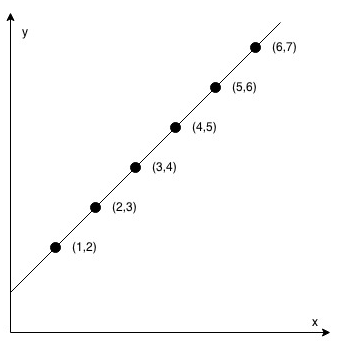
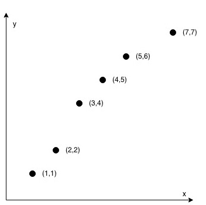

<!-- markdownlint-disable -->

# Check If It Is a Straight Line

You are given an array `coordinates`, `coordinates[i] = [x, y]` where `[x, y]` represents the coordinate of a point. Check if these points make a straight line in the XY plane.
 
 

**Example 1:**

<pre><code><strong>Input:</strong>          coordinates = [[1,2],[2,3],[3,4],[4,5],[5,6],[6,7]]
<strong>Output:</strong>         true</code></pre>
 

**Example 2:**

<pre><code><strong>Input:</strong>          coordinates = [[1,1],[2,2],[3,4],[4,5],[5,6],[7,7]]
<strong>Output:</strong>         false</code></pre>
 

**Constraints:**

<ul>
    <li><code>2 <= coordinates.length <= 1000</code></li>
    <li><code>coordinates[i].length == 2</code></li>
    <li><code>-104 <= coordinates[i][0], coordinates[i][1] <= 104</code></li>
    <li><code>coordinates</code> contains no duplicate point.</li>
</ul>
