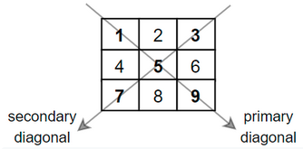

<!-- markdownlint-disable -->

# Matrix Diagonal Sum

Given a square matrix `mat`, return the sum of the matrix diagonals.

Only inlcude the sum of all the elements on the primary diagonal and all the elements on the secondary diagonal that are not part of the primary diagonal. 

 

**Example 1:**

<pre><code><strong>Input:</strong>          mat = [[1,2,3],
                       [4,5,6],
                       [7,8,9]]
<strong>Output:</strong>         25
<strong>Explanation:</strong>    Diagonals sum: 1 + 5 + 9 + 3 + 7 = 25
Notice that element mat[1][1] = 5 is counted only once.</code></pre>

**Example 2:**

<pre><code><strong>Input:</strong>          mat = [[1,1,1,1],
                       [1,1,1,1],
                       [1,1,1,1],
                       [1,1,1,1]]
<strong>Output:</strong>         8</code></pre>

**Example 3**:

<pre><code><strong>Input:</strong>          mat = [[5]]
<strong>Output:</strong>         5</code></pre>

**Constraints:**

<ul>
<li><code>n == mat.length == mat[i].length</code></li>
<li><code>1 <= n <= 100</code></li>
<li><code>1 <= mat[i][j] <= 100</code></li>
</ul>
