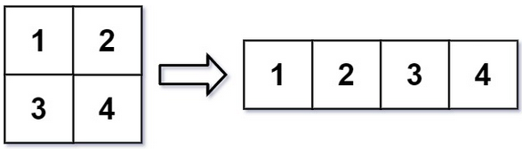
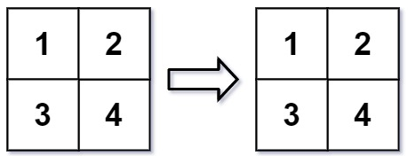

<!-- markdownlint-disable -->

# Reshape the Matrix

In MATLAB, there is a handy function called `reshape` which can reshape an `m x n` matrix into a new one with a difference size `r x c` keeping its original data.

You are given an `m x n` matrix `mat` and wo integers `r` and `c` representing the number of rows and the numbe of columns of the wanted reshaped matrix.

The reshaped matrix should be filled with all the elements of the original matrix, in the same row-traversing order as they were.

If the `reshape` operation with given parameters is possible and legal, output the new reshaped matrix; Otherwise, output the original matrix. 

 

**Example 1:**

<pre><code><strong>Input:</strong>          mat = [[1,2],[3,4]], r = 1, c = 4
<strong>Output:</strong>         [[1,2,3,4]]</code></pre>

**Example 2:**

<pre><code><strong>Input:</strong>          mat = [[1,2],[3,4]], r = 2, c = 4
<strong>Output:</strong>         [[1,2],[3,4]]</code></pre>

**Constraints:**

<ul>
<li><code>m == mat.length</code></li>
<li><code>n == mat[i].length</code></li>
<li><code>1 <= m, n <= 100</code></li>
<li><code>-1000 <= mat[i][j] <= 1000</code></li>
<li><code>1 <= r, c <= 300</code></li>
</ul>
